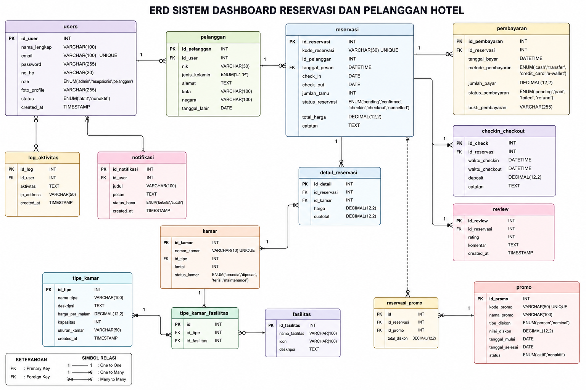
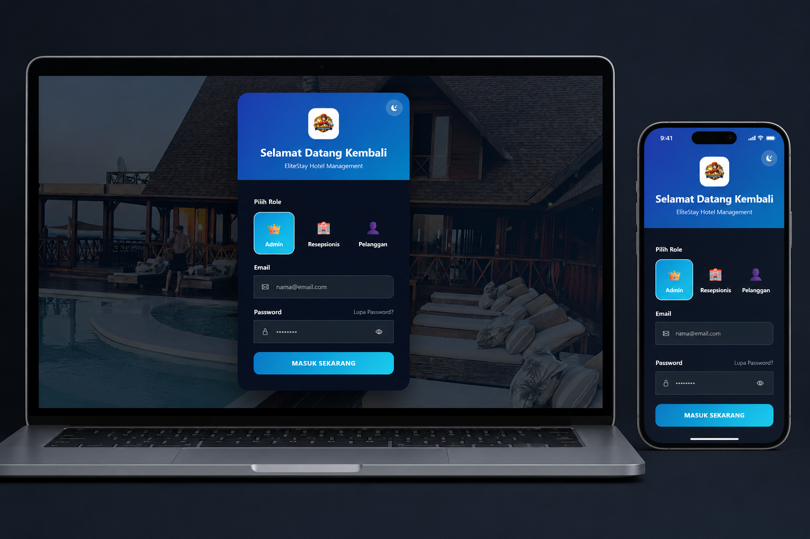
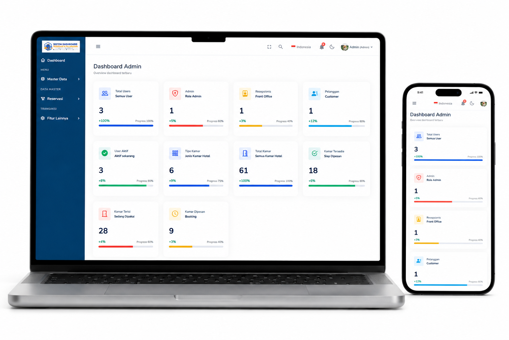
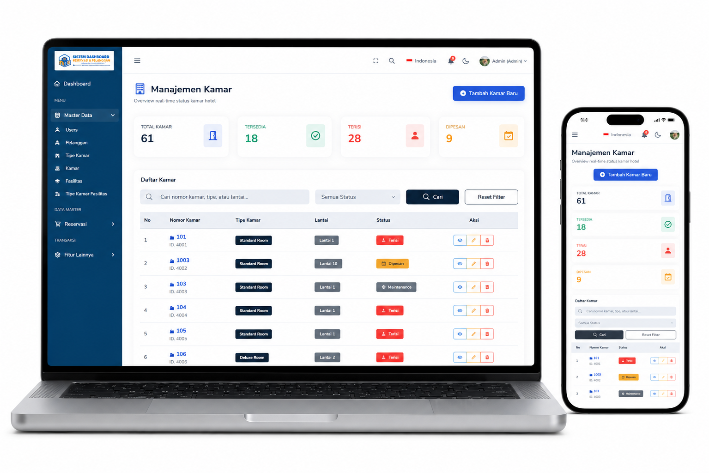

<p align="center">
  
</p>

<h1 align="center">🏨 Hotel Management Dashboard</h1>

<p align="center">
  <b>Modern Hotel Management System</b><br>
  Built with Laravel to streamline hotel operations efficiently, securely, and in real-time.
</p>

<p align="center">
  
  
  
  
</p>

<p align="center">
  <a href="#-fitur-utama">Fitur</a> •
  <a href="#-preview-aplikasi">Preview</a> •
  <a href="#-tech-stack">Tech Stack</a> •
  <a href="#-instalasi">Instalasi</a>
</p>

---

# 📌 Tentang Project

Hotel Management Dashboard adalah aplikasi manajemen hotel berbasis Laravel yang dirancang untuk membantu operasional hotel menjadi lebih modern, cepat, dan terintegrasi.

Sistem ini memungkinkan admin hotel mengelola reservasi, data tamu, pembayaran, dan monitoring kamar dalam satu dashboard yang intuitif dan responsive.

---

# ✨ Nilai Jual Project

✅ Clean Architecture & Scalable Structure  
✅ Responsive Modern Dashboard UI  
✅ Real-Time Room Monitoring  
✅ Authentication & Role Management  
✅ Business-Oriented System Design  
✅ Suitable for Enterprise & Hospitality Industry

---

# 🖼 Preview Aplikasi

## 🔹 ER Diagram

<p align="center">
  
</p>

---

## 🔹 Login Page

<p align="center">
  
</p>

---

## 🔹 Reservation Management

<p align="center">
  
</p>
<p align="center">
  
</p>

---

## 🔹 Room Management

<p align="center">
  
</p>

---

# 🚀 Fitur Utama

### 🛎 Reservation Management

- Booking & reservasi kamar
- Check-in / Check-out management
- Status reservasi real-time

### 🏨 Room Monitoring

- Monitoring ketersediaan kamar
- Room status management
- Room categorization

### 👥 Guest Management

- Data tamu terintegrasi
- Riwayat reservasi pelanggan
- Guest information system

### 💳 Payment System

- Manajemen transaksi pembayaran
- Invoice & payment tracking
- Transaction history

### 📊 Dashboard Analytics

- Statistik operasional hotel
- Revenue monitoring
- Reservation analytics

### 🔐 Security & Authentication

- Multi-role authentication
- Admin access management
- Secure login system

---

# 🧩 Tech Stack

| Technology               | Function                |
| ------------------------ | ----------------------- |
| Laravel                  | Backend Framework       |
| PHP                      | Server-side Programming |
| MySQL                    | Database Management     |
| Tailwind CSS / Bootstrap | Responsive UI Design    |
| JavaScript               | Interactive Frontend    |
| Blade Engine             | Template Rendering      |
| Eloquent ORM             | Database Abstraction    |
| Laravel Authentication   | Security System         |

---

# 🏗 System Architecture

```bash
Client Side (Browser)
        ↓
Laravel Routing
        ↓
Controller Layer
        ↓
Service / Business Logic
        ↓
Eloquent ORM
        ↓
MySQL Database

# Clone repository
git clone https://github.com/Rahmyvall/DashboardEliteStayHotel.git

# Masuk ke folder project
cd DashboardEliteStayHotel

# Install dependency
composer install

# Copy environment
cp .env.example .env

# Generate application key
php artisan key:generate

# Migration database
php artisan migrate

# Jalankan server
php artisan serve
```
